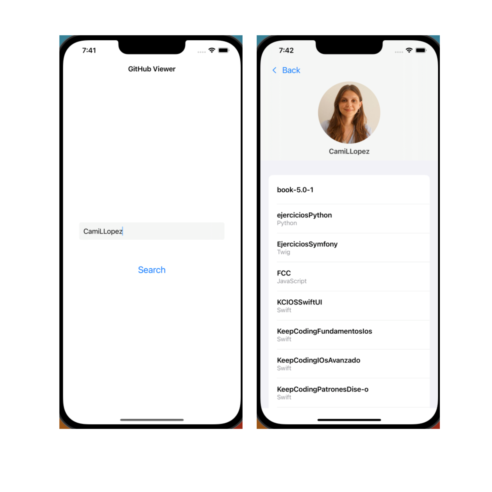

The solution of this challenge was built using SwiftUI and Combine. In order to run it, would be necessary to download this repository and run it in the latest version of Xcode.
It has two screens, the first allows you to search for a GitHub User and get their public repositories, the second will only appear if the search is successful and will show all the public repositories titles and their languages. 

This challenge was created using SwiftUI because of the adaptability to changes and in order to show a different technology that UIKit. 

